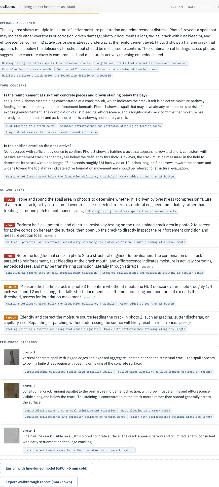

# Multimodal Building-Defect Inspection

An ML-powered building-defect inspection assistant, built end to end: data
pipeline, fine-tuning, retrieval, serving, web UI, and AWS infrastructure.
Upload a defect photo for ranked defect classes, a severity band, and cited
remediation guidance from an inspection-standards corpus - or run the
flagship **walkthrough diagnostic report**: up to 10 site photos plus a
free-text concern note become a grounded, cited draft diagnostic in which
every claim either cites a retrieved standards card or is replaced by an
explicit "not observed - verify on-site".

**Live demo:** https://d2wxjiu5re5mow.cloudfront.net

| Fine-tuned classifier | Guidance retrieval | Audio anomaly (pump) | Walkthrough groundedness |
| :---: | :---: | :---: | :---: |
| **0.851** macro top-1 | **0.863** recall@5 | **0.801** AUC (0.726 baseline) | **1.0** measured pre-gate |

## Walkthrough diagnostic report

One multimodal call sees every photo at once, so the report reasons across
them ("the staining at the crack in photo 4 means the photo-1 crack is an
active moisture pathway"). The trust story is deterministic, not
prompt-deep: a citation gate drops every uncited claim into an audit log,
per-photo claims may cite only that photo's own retrieval, every concern
gets a cited answer or an explicit "not observed", and an optional
GPU-backed fine-tuned label merges only when consistent with the
observation. Visual accuracy is hand-rated rather than faked with an LLM
judge - and the split it found is the honest headline:

| Spot-check | accurate observations |
|---|---|
| 256px dataset crops (hard) | 17/30 strict |
| realistic field photos | 8/8 primary |

Full methodology, mechanism, and results: **[docs/case-study.md](docs/case-study.md)**

## Stack

- **ML** - PyTorch + Hugging Face: QLoRA fine-tune of Qwen2.5-VL-3B (trained
  on EC2 spot, 0.472 -> 0.851 macro top-1; 0.877 maintained on a
  cross-dataset OOD split); CLIP/CLAP embeddings for cross-modal RAG and
  unsupervised audio anomaly scoring; a controlled thermal-fusion study
  reported as an honest negative (init-confound resolved to parity).
- **Serving** - FastAPI on a Lambda container behind CloudFront + API
  Gateway; async submit/poll job path (S3 + Lambda self-invoke); SageMaker
  async endpoint autoscaling 0-1 for the fine-tuned GPU model; Bedrock for
  vision reasoning; React SPA frontend.
- **Evals** - frozen golden sets with committed, regression-gated baselines
  for the classifier, retrieval, audio, the inspection agent (citation
  validity 0.741 -> 1.000 via an on-class filter), and the walkthrough
  (two golden sets: dataset crops + licensed realistic field photos).
- **Infra** - AWS CDK (Python), GitHub Actions CI/CD with keyless OIDC,
  CloudWatch ops dashboard, scale-to-zero cost posture.

## Run locally

    docker compose up -d db                        # pgvector (indexed corpus)
    uvicorn defectlens.serve.api:app --port 8000   # DEFECTLENS_NO_VLM=1 skips the 7GB VLM
    cd frontend && npm install && npm start        # http://localhost:3000

For the walkthrough locally: set `DEFECTLENS_LOCAL_JOBS=1` (in-process async
worker) and `DEFECTLENS_DESCRIBER=bedrock` on the API process. Tests:
`python -m pytest -q` and `cd frontend && npm test`. Realistic eval photos:
`bash scripts/fetch_realistic_walkthrough.sh` (licensed; see
`data/manifests/walkthrough_realistic_attribution.md`).

## Data and licenses

Trained/evaluated on CODEBRIM, BD3, SDNET2018, DCASE2020, METU/Ozgenel, and
BFDD (see `docs/datasets.md`); guidance corpus cites EPA/HUD/InterNACHI/
FHWA/NPS sources; UI gallery and realistic eval photos are CC-licensed with
attribution files alongside. Code is MIT.
