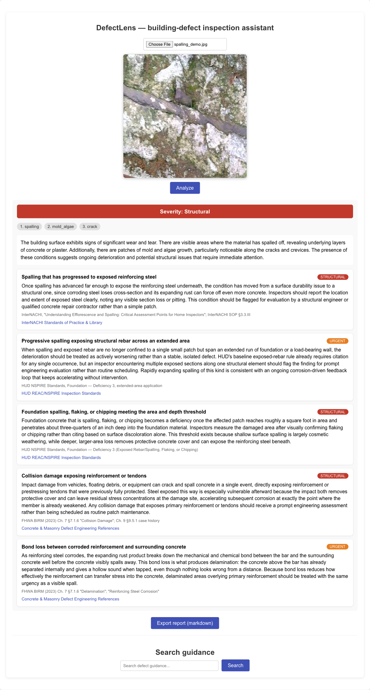
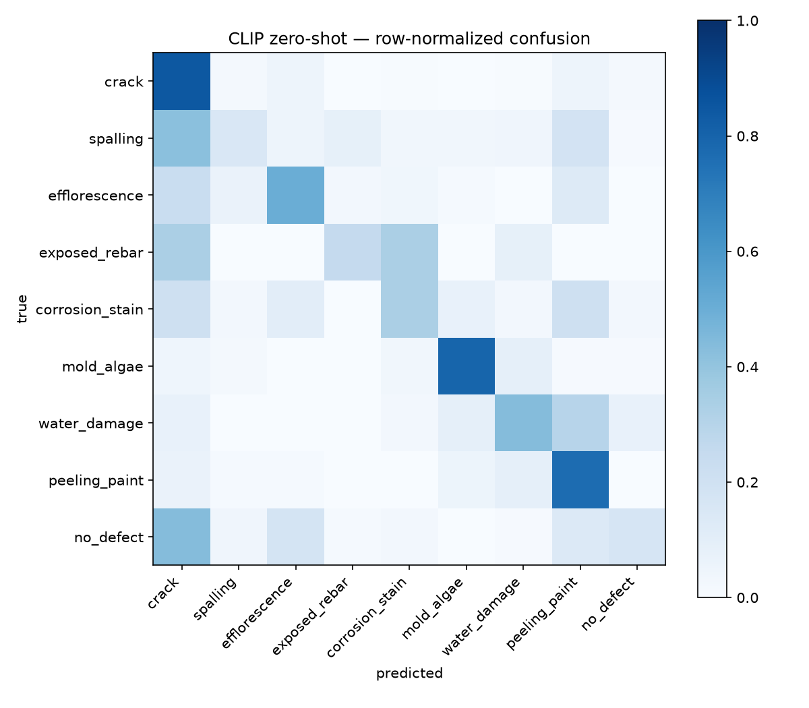

# DefectLens

Building-defect inspection assistant: photo → fine-grained defect ID + severity
framing + retrieved remediation guidance and standards citations.

Design spec: `docs/superpowers/specs/2026-07-06-defect-lens-design.md`

## Status

Phase 1 (dataset unification + CLIP zero-shot baseline) — **complete**.
Phase 2 (cross-modal RAG over inspection-standards corpus) — **complete**.
Phase 4 (local serving + React UI) — **complete** (pulled ahead of Phase 3).
Phase 3 (Qwen2.5-VL-3B QLoRA fine-tune on AWS) — **complete**.

## The Product

Upload a defect photo → ranked defect classes, severity band, natural-language
condition description (Qwen2.5-VL-3B on Apple Silicon; optional), and cited
guidance cards drawn from the 205-card standards corpus. Text search covers the
same corpus. One-click markdown report export. (~17s/analyze with the VLM on an
M3 Pro — most of it Qwen generation; ~1s with DEFECTLENS_NO_VLM=1.)

**Run it locally:**

    docker compose up -d db                  # pgvector (indexed corpus)
    uvicorn defectlens.serve.api:app --port 8000   # DEFECTLENS_NO_VLM=1 to skip the 7GB VLM
    cd frontend && npm install && npm start  # http://localhost:3000

Classifier: the Phase 3 fine-tuned Qwen2.5-VL-3B QLoRA adapter (macro top-1
0.851) ranks the defect classes; the free-text description is generated with
the adapter disabled (base weights) since the classification fine-tune
measurably degrades open-ended narration. With `DEFECTLENS_NO_VLM=1` (or no
adapter present) classification falls back to the measured CLIP RRF-fusion
pipeline (recall@5 0.863). `/health` reports which classifier is active.

## Phase 2 Results — Cross-Modal RAG

**Corpus:** 205 cited guidance cards (`corpus/`) from EPA, HUD NSPIRE,
InterNACHI, and FHWA/NPS engineering references — every class ≥15 cards,
severity-labelled, licensing-clean (own-words passages; ICC/ACI cited by
reference only). Indexed in pgvector (`docker compose up -d db`) as one shared
CLIP space with two vectors per card: an index-sentence text embedding and a
train-split-only exemplar-image centroid.

**Retrieval eval** (frozen `data/manifests/test.csv`, 2,648 image queries +
36 templated text queries; a card is relevant iff tagged with the query's true
class):

| Query mode | recall@5 |
|---|---|
| Text → text vectors | **1.000** |
| Image → exemplar centroids | 0.773 |
| Image → **RRF fusion** (centroid + zero-shot prompt rankings) | **0.863** |

Fusion of the two decorrelated rankings lifts the fine-grained failures
(crack 0.65→0.92, efflorescence 0.85→0.95); spalling (0.60) remains the
weakest class in both signal paths — the measured motivation for Phase 3's
fine-tune. Reproduce: `python -m defectlens.rag.embed` then
`python -m defectlens.eval.rag_recall --image-mode fused`.

## Results

Unified dataset: 17,652 images / 9 classes merged from CODEBRIM, BD3, and
SDNET2018 (`docs/datasets.md`); frozen stratified test split of 2,648 images
(`data/manifests/test.csv`, seed 42). Spot-check QA on the label mapping passed
(30 images/class sampled; all classes ≥90% plausible).

| Model | Macro top-1 | Macro top-3 | Split |
|---|---|---|---|
| CLIP ViT-L/14 zero-shot (prompt ensemble) | 0.472 | 0.747 | frozen `data/manifests/test.csv` |
| **Qwen2.5-VL-3B + QLoRA (Phase 3)** | **0.851** | **0.990** | same |

The fine-tune closes exactly the gaps zero-shot CLIP failed on: spalling
0.15→0.78, no-defect 0.17→0.88, exposed rebar 0.25→0.75, corrosion stain
0.33→0.77 — every class ≥0.75 top-1 (`results/vlm_topk_full.json`).
Training: one balanced epoch (3,751 steps, inverse-frequency sampling capped
at 20×) of rank-16 QLoRA over the LM's attention+MLP projections, 4-bit nf4
base, vision tower frozen; ~5.5h on a single g5.xlarge spot instance in
ca-central-1. Total AWS spend for the phase, including a smoke run and one
failed launch: **~$3.10**. Adapter: `models/qwen25vl-lora-v1/` (gitignored — canonical copy in the
phase-3 S3 bucket under `checkpoints/adapter/`); eval =
length-normalized answer log-likelihood ranking over the 9 class answers
(`src/defectlens/eval/vlm_topk.py`).

Zero-shot CLIP is strong on commodity classes (crack 0.85, mold/algae 0.80,
peeling paint 0.77 top-1) but fails on exactly the fine-grained distinctions an
inspector needs — spalling 0.15, no-defect 0.17, exposed rebar 0.25, corrosion
stain 0.33 — which is the measured gap the Phase 3 fine-tune exists to close.
Environment for these numbers is pinned in `requirements-lock.txt`
(transformers 5.13.0, torch — see lockfile).

## Setup

    python3 -m venv .venv && source .venv/bin/activate
    pip install -e ".[dev]"
    pytest
