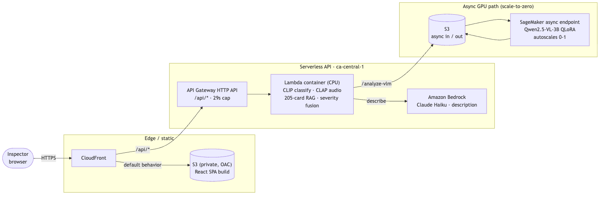
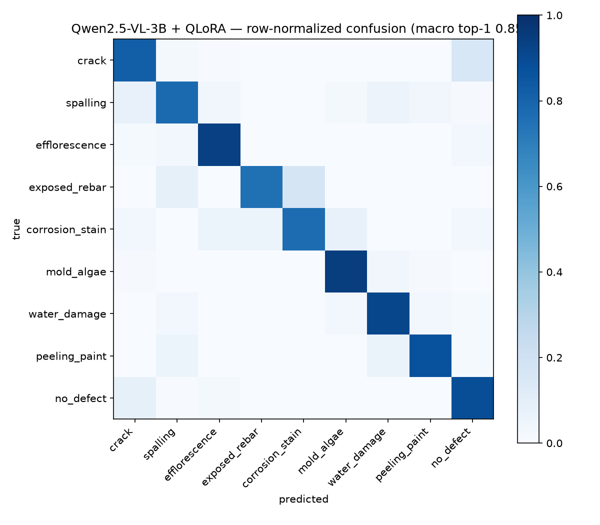
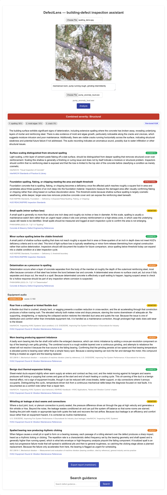

# DefectLens

DefectLens is a building-defect inspection assistant: upload a defect photo and it
returns ranked fine-grained defect classes, a severity band, a natural-language
condition description, and cited remediation guidance drawn from an inspection-
standards corpus - with optional equipment-audio anomaly screening in the same
request. A fine-tuned vision-language model does the classification; a cross-modal
RAG index over 205 cited guidance cards supplies the remediation advice.

**Live demo:** <https://d2wxjiu5re5mow.cloudfront.net>

| Fine-tuned classifier | Equipment-audio anomaly (pump) | Guidance retrieval |
| :---: | :---: | :---: |
| **0.851** macro top-1 | **0.801** AUC vs 0.726 baseline | **0.863** recall@5 |

Design spec: `docs/superpowers/specs/2026-07-06-defect-lens-design.md`

## Architecture

Two tiers sit behind a single CloudFront origin, so the SPA talks to one domain
with no CORS:

- **Static tier** - CloudFront serves the React single-page app from a private S3
  bucket (Origin Access Control; the bucket stays fully private).
- **Serverless API tier** (ca-central-1) - CloudFront routes `/api/*` to an API
  Gateway HTTP API (named stage, 29s integration cap) fronting a CPU Lambda
  container. The Lambda runs CLIP classification, CLAP equipment-audio anomaly
  scoring, 205-card cross-modal RAG retrieval, and severity fusion, and calls
  Amazon Bedrock (Claude Haiku) for the condition description. (Audio is disabled
  in the cloud today pending a Lambda memory-quota increase, and descriptions are
  temporarily empty while the new account's Bedrock quota activates - the client
  fails fast to a blank description rather than retrying into the throttle.)
- **Async GPU path** - the `/analyze-vlm` route hands the image to a SageMaker
  async endpoint (ml.g5.xlarge) running the Qwen2.5-VL-3B QLoRA fine-tune, with S3
  for async in/out - the 0.851-macro classifier in the cloud with no always-on GPU.
  The endpoint autoscales 0-1 on queue backlog and drains back to zero when idle
  (verified), so the first request after an idle period pays an instance spin-up +
  model load (several minutes); the UI polls `/vlm-status` while it runs.

## Run locally

    docker compose up -d db                        # pgvector (indexed corpus)
    uvicorn defectlens.serve.api:app --port 8000   # DEFECTLENS_NO_VLM=1 skips the 7GB VLM
    cd frontend && npm install && npm start        # http://localhost:3000

With `DEFECTLENS_NO_VLM=1` (or no adapter present) classification falls back to the
measured CLIP RRF-fusion pipeline; `/health` reports which classifier is active.

## Cost and the cold-start caveat

The demo runs scale-to-zero, so idle cost is roughly **$2/month** (S3 + CloudFront +
CloudWatch; no always-on compute), guarded by a $15/mo budget and a daily
cost-explorer cutoff. The trade-off is a cold start: after an idle period the Lambda
has to cold-load its models, which can exceed the API Gateway's 29s cap, so the
*first* request may fail. A keep-warm ping runs every 5 minutes to keep an instance
hot; warm requests return in ~2.4s. The UI auto-retries once on a cold-start timeout
and explains that the demo scales to zero, so a second try usually succeeds.

---

The sections below capture the per-phase methodology and measured results. They are
collapsed for readability - expand any one for the full write-up.

<b>Project status and the product</b>

## Status

Phase 1 (dataset unification + CLIP zero-shot baseline) — **complete**.
Phase 2 (cross-modal RAG over inspection-standards corpus) — **complete**.
Phase 4 (local serving + React UI) — **complete** (pulled ahead of Phase 3).
Phase 3 (Qwen2.5-VL-3B QLoRA fine-tune on AWS) — **complete**.

## The Product

Upload a defect photo → ranked defect classes, severity band, natural-language
condition description (Qwen2.5-VL-3B on Apple Silicon; optional), and cited
guidance cards drawn from the 205-card standards corpus. Text search covers the
same corpus. One-click markdown report export. (~17s/analyze with the VLM on an
M3 Pro — most of it Qwen generation; ~1s with DEFECTLENS_NO_VLM=1.)

**Run it locally:**

    docker compose up -d db                  # pgvector (indexed corpus)
    uvicorn defectlens.serve.api:app --port 8000   # DEFECTLENS_NO_VLM=1 to skip the 7GB VLM
    cd frontend && npm install && npm start  # http://localhost:3000

Classifier: the Phase 3 fine-tuned Qwen2.5-VL-3B QLoRA adapter (macro top-1
0.851) ranks the defect classes; the free-text description is generated with
the adapter disabled (base weights) since the classification fine-tune
measurably degrades open-ended narration. With `DEFECTLENS_NO_VLM=1` (or no
adapter present) classification falls back to the measured CLIP RRF-fusion
pipeline (recall@5 0.863). `/health` reports which classifier is active.

<b>Phase 2 Results — Cross-Modal RAG</b>

**Corpus:** 205 cited guidance cards (`corpus/`) from EPA, HUD NSPIRE,
InterNACHI, and FHWA/NPS engineering references — every class ≥15 cards,
severity-labelled, licensing-clean (own-words passages; ICC/ACI cited by
reference only). Indexed in pgvector (`docker compose up -d db`) as one shared
CLIP space with two vectors per card: an index-sentence text embedding and a
train-split-only exemplar-image centroid.

**Retrieval eval** (frozen `data/manifests/test.csv`, 2,648 image queries +
36 templated text queries; a card is relevant iff tagged with the query's true
class):

| Query mode | recall@5 |
|---|---|
| Text → text vectors | **1.000** |
| Image → exemplar centroids | 0.773 |
| Image → **RRF fusion** (centroid + zero-shot prompt rankings) | **0.863** |

Fusion of the two decorrelated rankings lifts the fine-grained failures
(crack 0.65→0.92, efflorescence 0.85→0.95); spalling (0.60) remains the
weakest class in both signal paths — the measured motivation for Phase 3's
fine-tune. Reproduce: `python -m defectlens.rag.embed` then
`python -m defectlens.eval.rag_recall --image-mode fused`.

<b>Results — unified dataset and fine-tune</b>

Unified dataset: 17,652 images / 9 classes merged from CODEBRIM, BD3, and
SDNET2018 (`docs/datasets.md`); frozen stratified test split of 2,648 images
(`data/manifests/test.csv`, seed 42). Spot-check QA on the label mapping passed
(30 images/class sampled; all classes ≥90% plausible).

| Model | Macro top-1 | Macro top-3 | Split |
|---|---|---|---|
| CLIP ViT-L/14 zero-shot (prompt ensemble) | 0.472 | 0.747 | frozen `data/manifests/test.csv` |
| **Qwen2.5-VL-3B + QLoRA (Phase 3)** | **0.851** | **0.990** | same |

The fine-tune closes exactly the gaps zero-shot CLIP failed on: spalling
0.15→0.78, no-defect 0.17→0.88, exposed rebar 0.25→0.75, corrosion stain
0.33→0.77 — every class ≥0.75 top-1 (`results/vlm_topk_full.json`).
Training: one balanced epoch (3,751 steps, inverse-frequency sampling capped
at 20×) of rank-16 QLoRA over the LM's attention+MLP projections, 4-bit nf4
base, vision tower frozen; ~5.5h on a single g5.xlarge spot instance in
ca-central-1. Total AWS spend for the phase, including a smoke run and one
failed launch: **~$3.10**. Adapter: `models/qwen25vl-lora-v1/` (gitignored — canonical copy in the
phase-3 S3 bucket under `checkpoints/adapter/`); eval =
length-normalized answer log-likelihood ranking over the 9 class answers
(`src/defectlens/eval/vlm_topk.py`).

Zero-shot CLIP is strong on commodity classes (crack 0.85, mold/algae 0.80,
peeling paint 0.77 top-1) but fails on exactly the fine-grained distinctions an
inspector needs — spalling 0.15, no-defect 0.17, exposed rebar 0.25, corrosion
stain 0.33 — which is the measured gap the Phase 3 fine-tune exists to close.

<b>Cross-dataset generalization (Phase 5.4)</b>

Does the fine-tune survive buildings it has never seen? Evaluated zero-shot
(no re-training) on 400 images sampled from an independently collected
dataset - Ozgenel & Gonenc Sorguc's METU campus crack corpus (Mendeley
5y9wdsg2zt, CC BY 4.0; different continent, photographer, and buildings
from all three training sources) - covering the crack/no-defect axis where
65% of in-distribution errors live:

| Class | In-distribution | METU (OOD) |
|---|---|---|
| crack | 0.818 | **0.990** |
| no_defect | 0.884 | 0.764 |
| macro (2 classes) | 0.851 | **0.877** |

Macro accuracy is fully maintained under the shift; what changes is the
error direction - the model becomes more crack-sensitive, catching nearly
every crack while false-alarming more on unfamiliar clean concrete. For an
inspection assistant this is the safer failure mode (a false alarm costs a
glance; a miss costs a defect). No recovery round was run: the pre-agreed
trigger imagined a macro drop that did not materialize. Scope honesty: the
other seven classes lack independent labeled sources at usable scale, so
this measures the dominant-error axis only. Reproduce:
`python -m defectlens.eval.vlm_topk --test-manifest data/manifests/ood_test.csv --adapter models/qwen25vl-lora-v1`.

<b>Audio in the product (Phase 5.3)</b>

`/analyze` now accepts photo + inspector note + equipment audio in one request.
The audio path scores the clip against a bank of 7,024 known-normal CLAP
embeddings, bands the score by thresholds calibrated on held-out normals
(monitor above the 90th percentile, urgent above the 99th: 0.073 / 0.134),
retrieves cited HVAC-maintenance guidance from a 47-card corpus in CLAP text
space, and fuses with the visual finding (worst-of severity + escalation when
both signals are bad; the narrative names both). Machine-type retrieval
accuracy: fan 1.00 / pump 0.86 / overall 0.93 (fan's family spans more tags,
so its bar is lower); fault-family precision within a machine type is
qualitative - MIMII carries no fault labels. Anomaly clips that sound close
to normal band as normal-operation - that is the AUC 0.80 operating point,
not a bug. Cards cite ASHRAE, DOE/EERE sourcebooks, ISO 20816, and
InterNACHI. Reproduce: `python -m defectlens.eval.audio_retrieval`.

<b>Audio anomaly detection (Phase 5.2)</b>

Unsupervised equipment-sound anomaly detection on the DCASE 2020 Task 2 dev
set (MIMII fan + pump): CLAP embeddings (laion/clap-htsat-unfused, no
training) + k-nearest-neighbor distance to each machine ID's NORMAL training
clips only, per the DCASE unsupervised protocol. AUC per machine ID vs the
official autoencoder baseline (Koizumi et al. 2020, arXiv:2006.05822;
per-ID numbers from the official baseline repo):

| Machine | id_00 | id_02 | id_04 | id_06 | avg | baseline avg |
|---|---|---|---|---|---|---|
| pump | **0.868** | **0.869** | 0.826 | 0.642 | **0.801** | 0.726 |
| fan | 0.538 | 0.632 | 0.479 | **0.761** | 0.602 | 0.652 |

Pump beats the baseline by +7.5 points average with zero trained parameters;
fan lands 5 below. A k sweep (1-20) moves either machine ~1 point and changes
no conclusion, so the pre-registered default (k=5) is reported. Our read on
the asymmetry: pump anomalies are transient events (cavitation, knocking) -
structure a general-audio embedding represents well - while fan anomalies are
subtle spectral shifts inside stationary broadband hum that 10-second global
clip embeddings compress away; fan is likewise the hardest machine for the
DCASE baseline. Framing per spec: this is an industrial-equipment audio
benchmark, HVAC-motivated - real HVAC acoustics differ. Reproduce:
`bash scripts/fetch_dcase_audio.sh` then `python -m defectlens.eval.audio_auc`
(results/audio_auc.json). Dataset: DCASE 2020 Task 2 dev set (MIMII/ToyADMOS
consortium), CC BY-NC-SA 4.0, zenodo.org/records/3678171.

<b>Inspector notes (Phase 5.1)</b>

`/analyze` accepts an optional free-text inspector note. The note conditions
guidance-card retrieval (a third list in the RRF fusion - e.g. a "north
foundation wall" note promotes HUD's foundation-specific card to rank 1) and
is embedded in the exported report; classification stays evidence-based.
A three-condition sensitivity study (`results/note_sensitivity.json`, 40
crack/no-defect test images) measured classifier response to note text:

| Condition | Macro top-1 |
|---|---|
| Empty note (hard gate: must equal baseline) | 0.900 |
| Informative scene-context note | 0.900 |
| Misleading off-topic note | 0.900 |

The fine-tuned classifier is note-invariant: notes never hurt (gate passed
exactly) and also never swayed a prediction - including deliberately
misleading ones, which doubles as prompt-injection robustness for the note
field. Caveats stated plainly: informative notes were hand-authored by the
project authors while viewing the images (this measures prompt sensitivity,
not field accuracy gain); the deterministic subset selection drew all-BD3
images (visible cracks, 0.90 subset accuracy) rather than the hardest SDNET
hairline tiles; and the measured retrieval recall@5 of 0.863 applies to the
two-list no-note fusion - note-conditioned retrieval is qualitatively
verified but not yet quantitatively benchmarked.

Environment for these numbers is pinned in `requirements-lock.txt`
(transformers 5.13.0, torch — see lockfile).

<b>Setup (development)</b>

    python3 -m venv .venv && source .venv/bin/activate
    pip install -e ".[dev]"
    pytest

